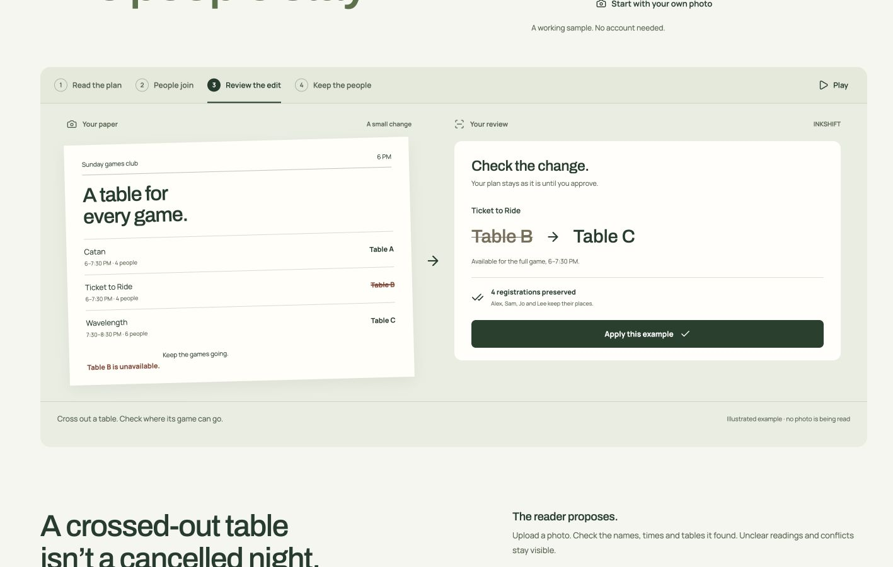

# INKSHIFT

Photograph a small-event plan, review the reading, and share a signup page. Photograph an edit later and move the same game with its existing registrations.

Built for [DEV's Sanity Challenge, Path Two](https://dev.to/challenges/sanity-2026-09-16). The landing demonstrates a paper plan, phone signup, review and relocation. Its illustrative registrations are labeled; the real sample opens a separate event.

**[Open INKSHIFT](https://inkshift.vercel.app)**

[Watch the 43-second product walkthrough](docs/video/inkshift-product-walkthrough.mp4). This edited browser sequence shows setup, a prepared sample, a guest booking and its move from B to C.



## Run locally

Use Node.js 24 and npm. The lockfile fixes the tested dependency tree.

```sh
npm ci
cp .env.example .env.local
# Fill in your Sanity project and server-only tokens.
npm run workflows:deploy
npm run dev -- --port 3333
```

`workflows:deploy` reads `.env.local` and deploys only this project's review definition. It opts out of sharing definitions with Sanity. It requires an existing dataset and a token with access to it. See [the workflow implementation](docs/WORKFLOWS.md).

Open http://localhost:3333. **Plan a gathering** opens setup for a name, date and time zone. Add a photo or type a plan, approve it, then invite people. **Try a sample** creates a separate practice gathering. **Your gatherings** lists plans this browser can manage. Save a private organizer access code from the workspace to restore access on another device.

For a provider-free local trial, clear server and `NEXT_PUBLIC_*` Sanity project variables, omit vision variables and set `INKSHIFT_REQUIRE_SANITY=false`. The app labels local storage and uses SQLite in `.inkshift/`. Prepared examples and manual entry work. Sanity workflow history is unavailable in local mode; domain review rules still apply. Vercel deployments refuse local storage.

```sh
npm run build
npm start -- --port 3333
```

Configure the same environment variables on the host. `NEXT_PUBLIC_*` values are embedded at build time. Keep API tokens server-side. Use HTTPS for hosted capability cookies. `vercel.json` selects the Next.js framework and the project uses Node.js 24.

## Sanity

Project **a5xdqsb7**, dataset **production**. Credentials are excluded from source.

The event aggregate, spaces, sessions, registrations, photos and proposals are linked records. Each domain write updates its records and public projection in one revision-checked transaction. Anonymous App SDK queries read a root-ID projection containing the schedule and counts. Private dot-path documents hold access hashes, participant names, registrations, proposals, photos and workflow instances.

`/event/<id>/inspector` uses App SDK directly and shows stable session IDs with their current table and count. The organizer also subscribes through App SDK and polls the server as a recovery path. Add your application's exact origin to Sanity CORS for browser subscriptions. Server routes authorize mutations and participant-specific reads.

Sanity Workflows records Reading → Review → Applied or Discarded. Its approval requirement blocks unresolved checks. Organizer corrections update the same run. Event and proposal revision checks remain the final transaction guard. The saved proposal decision lets the workflow recover after an interrupted follow-up write without applying the plan twice. Saved reviews can be reopened from the organizer.

Studio configuration lives in `sanity/`. Domain records are read-only there because direct edits would bypass event transaction checks. Run that package separately to inspect its schema. The current schema validates with zero errors or warnings, and the Studio builds locally. Remote schema and Studio deployment remain under the earlier handoff instruction; this internal inspector is not required for public app use. Workflow definition deployment uses the Content Lake credential and has been verified independently.

## Demo in two browsers

1. Open a sample games night and choose **Invite people**.
2. Open the participant link on another device or browser. Join Ticket to Ride.
3. Choose **Use the crossed-out example** in the organizer. Review the proposed table removal, move and affected registrations.
4. Approve. The participant sees Table C and keeps the same booking.
5. Reopen the saved review to see its completed workflow. Open **Content inspector** to inspect the same session ID and updated count.

Prepared examples do not call a model. The actual photo path uses a vision provider and can require manual corrections. A reading never approves itself.

## Checks and evidence

```sh
npm run typecheck
npm run lint
npm test
npm run build
# Writes demo records to the configured Sanity project:
npm run test:live
# Uses the running app and its Sanity Workflows integration:
npm run test:workflow-http
# Real setup, private listing, typed plans and organizer recovery:
npm run test:product-http
# Makes two provider-limited inference calls through the running app:
npm run test:http
```

The suite has 31 tests: 19 domain tests, six tests using the actual workflow engine with its in-memory test bench, and six organizer-continuity tests. Live checks cover stale approval, relocation with stable booking IDs, discard, recorded caller context and private document access. Dated reports distinguish local production mode from the hosted app.

See [verification and limitations](docs/VERIFICATION.md), [architecture](docs/ARCHITECTURE.md), [workflow recovery](docs/WORKFLOWS.md), [demo script](docs/DEMO.md), and [unpublished DEV article](docs/DEV-POST.md).

## Current limits

Photographed handwriting, difficult lighting and the camera permission flow on physical phones have not been validated. Current image evidence uses rendered typed sheets. The app supports same-day sessions, up to 12 spaces, 30 sessions and 300 registrations per event. Organizer access lives in a 30-day browser cookie. A saved private bearer code restores that access on another device; it does not establish a user account. Losing both the code and the original browser access cannot be recovered. The code is not revocable through an in-app interface yet. Invite holders can book, and a determined person can reserve from multiple browsers. Daily event and photo caps are global quota guards, not per-person abuse prevention.

Photos stay in private Sanity documents and are sent to the configured vision provider. The previous photo and approved plan may also be sent to resolve an edit; participant names and access hashes are excluded from the model context. There is no automatic retention/deletion interface.

The physical-paper video, DEV publication and submission receipt remain unfinished. The challenge permits one submission per path.
