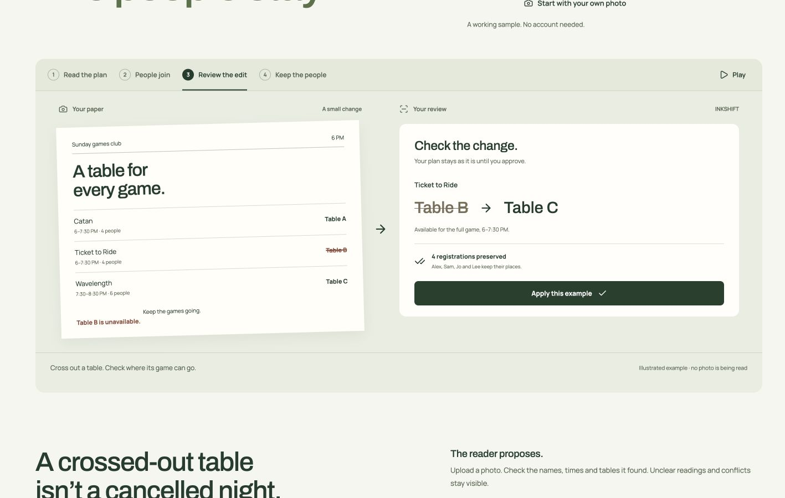

# INKSHIFT

INKSHIFT turns a paper plan for a games night, workshop or club meetup into a live signup page backed by Sanity. Photograph or type the plan, review the reading and share the invite; guests book a place without an account. When the paper changes (cross out Table B, write Table C), photograph it again: the organizer reviews the proposed edit against the people already booked, approves it and the same bookings move with their session. The **Paper time machine** under the live plan then scrubs through every applied version of the paper, with each session and its booking tokens sliding between tables.

Built for [DEV's Sanity Challenge, Path Two](https://dev.to/challenges/sanity-2026-09-16). The landing demonstrates a paper plan, phone signup, review and relocation. Its illustrative registrations are labeled; the real sample opens a separate event. The illustration starts with the original plan and advances only when you choose a step or press Play. The organizer sees the live plan before the paper source; the labeled History control opens saved changes. Decorative loops pause while their section is offscreen, and the time machine animates only a chosen version transition.

**[Open INKSHIFT](https://inkshift.vercel.app)**

[Watch the 43-second product walkthrough on YouTube](https://youtu.be/xM5eC-q7t_0). This edited browser sequence shows setup, a prepared sample, a guest booking and its move from B to C.



## Run locally

Use Node.js 24 and npm. The lockfile fixes the tested dependency tree.

### Without any credentials

With no `SANITY_PROJECT_ID` or token set, INKSHIFT stores events in SQLite under `.inkshift/` and labels the storage as local. Prepared samples, manual plans, bookings, reviews and the time machine all work; photo reading and Sanity Workflows history do not.

```sh
git clone https://github.com/himanshu748/inkshift.git
cd inkshift
npm ci
npm run dev -- --port 3333
```

Open http://localhost:3333 and choose **Try the guided sample**. `curl http://localhost:3333/api/health` should report `"storage":"local"`.

### With Sanity

```sh
npm ci
cp .env.example .env.local
# Fill in your Sanity project and server-only tokens.
npm run workflows:deploy
npm run dev -- --port 3333
```

`workflows:deploy` reads `.env.local` and deploys only this project's review definition. It opts out of sharing definitions with Sanity. It requires an existing dataset and a token with access to it. See [the workflow implementation](docs/WORKFLOWS.md).

Open http://localhost:3333. **Plan a gathering** opens setup for a name, date and time zone. Add a photo or type a plan, approve it, then invite people. **Try the guided sample** creates a separate practice gathering with a four-step guide: open the participant page, book Ticket to Ride at Table B, review the prepared move to Table C, and check the saved booking. Its identity proof is shown only after an actual applied move and a registration made before it; no demo guests are created automatically. **Your gatherings** lists plans this browser can manage. Save a private organizer access code from the workspace to restore access on another device.

To fall back to local storage in a checkout that has a `.env.local`, clear the server and `NEXT_PUBLIC_*` Sanity variables, omit vision variables and set `INKSHIFT_REQUIRE_SANITY=false`. Domain review rules still apply in local mode. Vercel deployments refuse local storage.

```sh
npm run build
npm start -- --port 3333
```

Configure the same environment variables on the host. `NEXT_PUBLIC_*` values are embedded at build time. Keep API tokens server-side. Use HTTPS for hosted capability cookies. `vercel.json` selects the Next.js framework and the project uses Node.js 24.

## Sanity

Project **a5xdqsb7**, dataset **production**. Credentials are excluded from source.

The event aggregate, spaces, sessions, registrations, photos and proposals are linked records. Each domain write updates its records and public projection in one revision-checked transaction. Anonymous App SDK queries read a root-ID projection containing the schedule and counts. Its ID is a SHA-256 digest of the event invite ID; neither the invite ID nor a private-event reference appears in the public document. Private dot-path documents hold access hashes, participant names, registrations, proposals, photos and workflow instances.

`/event/<id>/inspector` uses App SDK directly and shows stable session IDs with their current table and count. The organizer also subscribes through App SDK and polls the server as a recovery path. Add your application's exact origin to Sanity CORS for browser subscriptions. Server routes authorize mutations and participant-specific reads.

Sanity Workflows records Reading → Review → Applied or Discarded. Its approval requirement blocks unresolved checks. Organizer corrections update the same run. Event and proposal revision checks remain the final transaction guard. The saved proposal decision lets the workflow recover after an interrupted follow-up write without applying the plan twice. Saved reviews can be reopened from the organizer.

Studio configuration lives in `sanity/`. Domain records are read-only there because direct edits would bypass event transaction checks. Run that package separately to inspect its schema. The schema validates with zero errors or warnings and is deployed to project a5xdqsb7 as `_.schemas.inkshift`: first on September 24, 2026, then again on September 25 with the `planBefore` snapshot field. The Studio itself is not hosted; it is not required for public app use. Workflow definition deployment uses the Content Lake credential and has been verified independently.

## Demo in two browsers

1. Open a sample games night and choose **Invite people**.
2. Open the participant link on another device or browser. Join Ticket to Ride.
3. Choose **Use the crossed-out example** in the organizer. Review the proposed table removal, move and affected registrations.
4. Approve. The participant sees Table C and keeps the same booking.
5. Reopen the saved review to see its completed workflow. Open **Content inspector** to inspect the same session ID and updated count.
6. Scroll to **Paper time machine** and drag from version 1 to 2. Ticket to Ride slides from Table B to Table C and the booking token travels with it.

Prepared examples do not call a model. The actual photo path uses a vision provider and can require manual corrections. A reading never approves itself.

## Checks and evidence

```sh
npm run typecheck
npm run lint
npm test
npm run build
# Writes demo records to the configured Sanity project:
npm run test:live
# Uses the running app and its Sanity Workflows integration:
npm run test:workflow-http
# Real setup, private listing, typed plans and organizer recovery:
npm run test:product-http
# Makes two provider-limited inference calls through the running app:
npm run test:http
```

The suite covers domain rules, the actual workflow engine with its in-memory test bench, organizer continuity, time machine history, stale-tab decisions, Unicode identities and registration limits. `node --env-file=.env.local scripts/timeline-dataset-check.mjs` reruns the read-only GROQ check behind the time machine ([latest result](docs/evidence/timeline-dataset-check.json)). Live checks cover stale approval, relocation with stable booking IDs, discard, recorded caller context and private document access. Dated reports distinguish local production mode from the hosted app.

See [verification and limitations](docs/VERIFICATION.md), [architecture](docs/ARCHITECTURE.md), [workflow recovery](docs/WORKFLOWS.md), [demo script](docs/DEMO.md) and the [DEV post](https://dev.to/himanshu_748/inkshift-cross-out-a-table-keep-the-booking-344i) ([source](docs/DEV-POST.md)).

## Current limits

One photographed handwritten schedule was checked on September 30 ([results](docs/evidence/handwritten-photo-check.json)). The reader guessed missing seat limits; every new photo reading now requires an explicit organizer capacity check before approval. The rerun used operator-set limits and a title correction. Difficult lighting, general handwriting accuracy and camera capture on physical phones remain unverified. Earlier image checks used rendered typed sheets. The app supports same-day sessions, up to 12 spaces, 30 sessions and 300 active registrations per event. Each event retains up to 1,200 lifetime registration records, including cancellations; further joins require a new gathering. One browser can make up to 20 joins per event in 10 minutes. Existing bookings remain viewable and cancellable at either limit. Organizer access lives in a 30-day browser cookie. A saved private bearer code restores that access on another device; it does not establish a user account. Losing both the code and the original browser access cannot be recovered. The code is not revocable through an in-app interface yet. Invite holders can book, and a determined person can reserve from multiple browsers. Daily event and photo caps remain persisted global quota guards. A bounded in-process burst guard permits 10 organizer-access attempts, 5 new gatherings and 3 photo scans per minute per client IP, returning HTTP 429 with Retry-After before body or store work. On Vercel it uses the platform-supplied x-vercel-forwarded-for header ([request-header documentation](https://vercel.com/docs/headers/request-headers)); other hosts and missing or malformed platform headers share one fallback bucket. Clients behind the same public IP also share limits. Buckets expire after one minute, and the guard refuses new buckets at its 10,000-entry ceiling without resetting active limits. This guard resets on process restart and does not coordinate serverless instances; it is a burst reduction measure, not a distributed per-person quota or global spend cap.

Photos stay in private Sanity documents and are sent to the configured vision provider. The previous photo and approved plan may also be sent to resolve an edit; participant names and access hashes are excluded from the model context. There is no automatic retention/deletion interface.

### Migrating legacy public projections

Before deploying this change to an existing dataset, preview the migration with Node 24:

```sh
node --env-file=.env.local --conditions=react-server --import tsx scripts/migrate-public-projections.ts
```

The default is read-only and bounded to 200 public documents. `--limit=1000` raises that bound. After review, run the same command with `--apply` to replace each legacy projection with its safe hashed document and delete the old projection in one revision-guarded transaction. Reruns skip already migrated records. The report contains counts only; missing private events and concurrent changes are skipped for manual review. Deploy the matching App SDK update together with this migration. Previously exposed invite IDs cannot be made secret by changing projection IDs; existing invites would require separate rotation.
