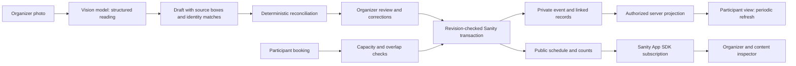

# How INKSHIFT preserves a gathering

The model proposes a reading. Deterministic code decides whether the resulting plan is safe to apply. A participant books a stable session identity rather than the current label or physical table.

## Domain identities

`Space` is the physical resource, such as Table B. `Session` is the game at a time, such as Ticket to Ride from 18:00 to 19:30. `Booking` points to the session. Removing B can move that same session to C if C has enough capacity and is free for the entire interval. It never merges players into an unrelated game.

Photo readings carry existing IDs where the model can identify the same entity. Exact unique matches can preserve identity without the model's help. Ambiguous or absent entities are kept and flagged for review. A cropped photograph is not treated as deletion. Explicit session removal with registrations, over-capacity plans, overlapping bookings and unavailable destinations block approval.

## The transaction boundary

`inkshift.event.<id>` is the aggregate that locks the decision. The service reads its `_rev`, recalculates seat availability or the proposed plan, and commits with `ifRevisionId`. The approved proposal's revision is also guarded so it cannot be edited between review and approval. The aggregate, linked records and public projection are written atomically. Competing reservations retry against the latest aggregate; stale approvals ask the organizer to recheck.

The design is deliberately bounded to small events. Rewriting a large event aggregate would become expensive; a larger product would need a different allocation design and load testing.

## Read and access boundaries

The organizer gets a random HttpOnly capability cookie; the database stores a hash. Participants use a separate browser cookie. Public routes return the schedule and only the caller's own bookings. Anonymous Content Lake access was tested to return the public projection and no private event document. Private photographs have an organizer-authorized server route.

The public projection gives App SDK a direct live subscription without sending a write token to the browser. A 2.5-second server poll recovers from a failed subscription. The inspector demonstrates the App SDK read explicitly; it is not an alternate write path.

## Image interpretation

The current provider is Hugging Face Inference Providers using `Qwen/Qwen3-VL-30B-A3B-Instruct:novita`. Requests enforce a JSON schema, then pass through Zod validation. The schema's four-number evidence boxes are represented as homogeneous arrays for provider compatibility. Original and edited images are data; their text is never executed as code or tool instructions.

Invalid output, provider quota errors and uncertain readings are visible failures. There is no silent replacement of a failed scan with the prepared sample. Organizer corrections go through the same deterministic reconciliation and revision check.

## Workflow coordination

The organizer's routes use the actual Sanity workflow engine. A reading enters a deterministic run with the proposal as its subject. The engine records its source and unresolved-check count; zero unresolved checks enables approval. The server checks owner authorization and both document revisions before applying the event. A saved proposal decision lets the engine retry its follow-up transition after a partial failure. See [Workflows](WORKFLOWS.md) for the boundary and recovery details.

## Landing runtime

The landing is a DOM product walkthrough with four selectable stages and an optional play control. The paper, game and illustrative people remain recognizable as the example changes. CSS handles the brief transitions; reduced motion removes them. Native scrolling and keyboard controls remain available. Its illustration never writes event data. The launch action creates a separate organizer event.
